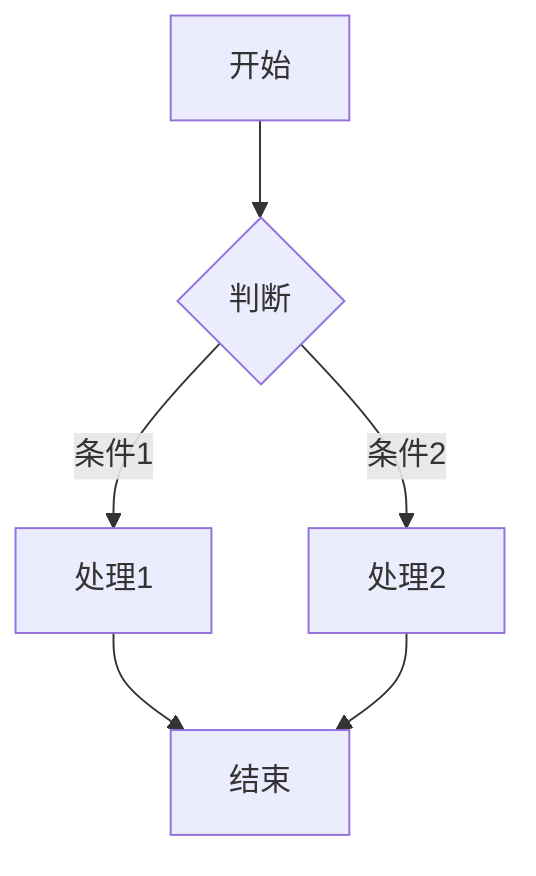

## 1. 标题与段落

这是一段普通的段落文字。你可以在这里自由书写。

### 1.1 二级标题下的三级标题

段落之间用一个空行分隔。

## 2. 文字样式

- **粗体**
- *斜体*
- ***粗斜体***
- ~~删除线~~
- `行内代码`

## 3. 列表

### 无序列表
- 项目一
- 项目二
  - 嵌套项目
  - 另一个嵌套

### 有序列表
1. 第一步
2. 第二步
   1. 子步骤
   2. 子步骤

## 4. 引用

> 这是一段引用文字。可以用于强调或引用他人话语。
>
> 引用可以跨多行。

## 5. 代码块

```
python
def hello():
    print("Hello, Chirpy!")
    return True
```

6. 表格

| 姓名 | 年龄 | 职业     |
|:-----:|:-----:|:---------:|
| 张三 |   25 | 工程师   |
| 李四 |   30 | 设计师   |
| 王五 |   28 | 产品经理 |

7. 数学公式（需在 Front Matter 中启用 math: true）

行内公式：$E = mc^2$

独立公式：

\[
\int_{a}^{b} f(x)\, dx = F(b) - F(a)
\]

8. Mermaid 流程图（需在 Front Matter 中启用 mermaid: true）



9. 图片


图片可以加一段说明文字（可选）

10. 视频嵌入

<div style="position: relative; width: 100%; padding-bottom: 56.25%; /* 16:9 比例 = 9/16 = 0.5625 */">
  <iframe 
    style="position: absolute; top: 0; left: 0; width: 100%; height: 100%;" 
    src="https://player.bilibili.com/player.html?bvid=BV1RB4y1Q7fR&page=1&high_quality=1&as_wide=1&allowfullscreen=true" 
    title="Bilibili video" 
    frameborder="0" 
    allowfullscreen>
  </iframe>
</div>

11. 脚注

这里需要添加一个脚注[^1]。

[^1]: 这是脚注的具体内容，可以写多行，但第二行需要缩进。

12. 分割线

---

13. 任务列表

- [x] 已完成任务
- [ ] 未完成任务
- [ ] 另一个待办

14. 注脚与缩写

HTML 是超文本标记语言<abbr title="HyperText Markup Language">HTML</abbr>的缩写。

*[HTML]: HyperText Markup Language
HTML 是超文本标记语言 HTML 的缩写。

---

